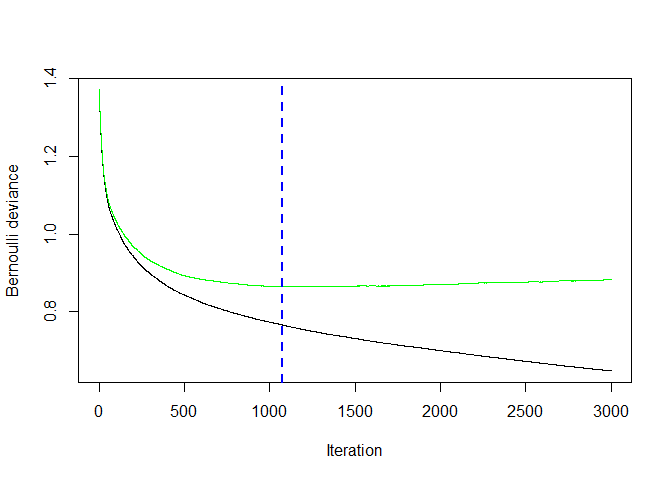
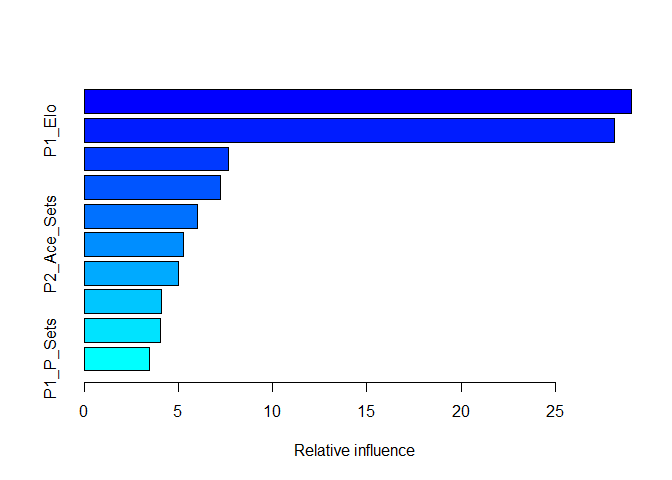
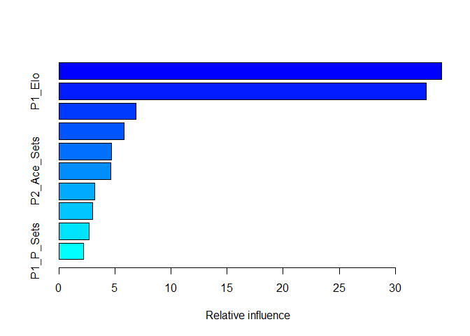

ATP Analysis
================
Jeremy Fischer
4/15/2022

  - [Introduction](#introduction)
  - [Data manipulation and variable
    engineering](#data-manipulation-and-variable-engineering)
  - [Modeling and Results](#modeling-and-results)
  - [Conclusion](#conclusion)

## Introduction

Each record of this data has the winner and loser of an ATP tennis
match, along with some match statistics, played between 2015-2019. This
analysis will focus on building a model to predict the outcome of a
men’s ATP tennis match. Our response or label will be based on
randomizing the winner of each match into a variable, say called Player
One. Then for features I’ll focus on player rankings, player Elo
ratings, and some aggregated summary statistics on each player.
Specifically I would like to have percentage of matches won over the
past year, percentage of sets won over the past year, and average number
of aces per set for each player. There is other information available,
such as first and second serve points won, break-points, break-points
saved, etc. however, I will only focus on the features mentioned above.
A future extension of this analysis could explore these additional data.

## Data manipulation and variable engineering

First let’s load our libraries and 2015-2019 ATP match data

``` r
library(tidyverse)
library(lubridate)
library(knitr)
library(gbm)
library(caret)

filea <- './git_data/atp_matches_'

df_final <- data.frame()
for(i in 2015:2019){
  df_use <- read.csv(file=paste0(filea, i, ".csv"))
  df_final <- rbind(df_final, df_use)
}
str(df_final)
```

    ## 'data.frame':    14440 obs. of  49 variables:
    ##  $ tourney_id        : chr  "2015-339" "2015-339" "2015-339" "2015-339" ...
    ##  $ tourney_name      : chr  "Brisbane" "Brisbane" "Brisbane" "Brisbane" ...
    ##  $ surface           : chr  "Hard" "Hard" "Hard" "Hard" ...
    ##  $ draw_size         : int  28 28 28 28 28 28 28 28 28 28 ...
    ##  $ tourney_level     : chr  "A" "A" "A" "A" ...
    ##  $ tourney_date      : int  20150104 20150104 20150104 20150104 20150104 20150104 20150104 20150104 20150104 20150104 ...
    ##  $ match_num         : int  1 2 3 4 5 6 7 8 9 10 ...
    ##  $ winner_id         : int  105357 103813 105902 104871 105373 105238 103997 105032 105062 106423 ...
    ##  $ winner_seed       : int  NA NA NA NA NA 7 NA NA NA NA ...
    ##  $ winner_entry      : chr  "WC" "" "WC" "" ...
    ##  $ winner_name       : chr  "John Millman" "Jarkko Nieminen" "James Duckworth" "Jeremy Chardy" ...
    ##  $ winner_hand       : chr  "R" "L" "R" "R" ...
    ##  $ winner_ht         : num  183 185 183 188 190 180 190 193 183 196 ...
    ##  $ winner_ioc        : chr  "AUS" "FIN" "AUS" "FRA" ...
    ##  $ winner_age        : num  25.6 33.5 23 27.9 25.5 ...
    ##  $ loser_id          : int  105733 106045 104468 104979 103781 104122 104731 103720 105657 103898 ...
    ##  $ loser_seed        : int  NA NA 6 NA NA NA 5 NA NA 8 ...
    ##  $ loser_entry       : chr  "Q" "Q" "" "" ...
    ##  $ loser_name        : chr  "Rhyne Williams" "Denis Kudla" "Gilles Simon" "Andrey Golubev" ...
    ##  $ loser_hand        : chr  "R" "R" "R" "R" ...
    ##  $ loser_ht          : num  NA 180 183 185 183 183 203 180 193 185 ...
    ##  $ loser_ioc         : chr  "USA" "USA" "FRA" "KAZ" ...
    ##  $ loser_age         : num  23.8 22.4 30 27.5 33.6 ...
    ##  $ score             : chr  "6-3 6-1" "4-6 6-1 6-4" "6-2 6-2" "6-4 6-4" ...
    ##  $ best_of           : int  3 3 3 3 3 3 3 3 3 3 ...
    ##  $ round             : chr  "R32" "R32" "R32" "R32" ...
    ##  $ minutes           : int  65 104 68 69 144 78 110 59 113 75 ...
    ##  $ w_ace             : int  6 4 4 7 9 6 6 14 3 9 ...
    ##  $ w_df              : int  2 0 0 1 4 1 5 0 1 1 ...
    ##  $ w_svpt            : int  44 92 45 53 130 49 78 47 84 52 ...
    ##  $ w_1stIn           : int  24 59 27 39 79 31 51 34 56 30 ...
    ##  $ w_1stWon          : int  19 39 20 31 55 24 35 30 42 25 ...
    ##  $ w_2ndWon          : int  14 17 11 11 27 12 14 8 16 14 ...
    ##  $ w_SvGms           : int  8 14 8 10 16 9 11 9 15 10 ...
    ##  $ w_bpSaved         : int  1 4 2 0 6 3 3 2 1 1 ...
    ##  $ w_bpFaced         : int  1 7 3 0 8 4 5 2 3 2 ...
    ##  $ l_ace             : int  3 6 2 9 4 3 12 1 17 5 ...
    ##  $ l_df              : int  4 1 1 2 4 2 3 2 2 3 ...
    ##  $ l_svpt            : int  50 83 56 57 95 78 76 45 89 52 ...
    ##  $ l_1stIn           : int  31 50 37 38 62 53 43 22 56 33 ...
    ##  $ l_1stWon          : int  20 26 22 30 40 32 30 13 46 23 ...
    ##  $ l_2ndWon          : int  5 19 5 8 19 8 17 14 15 7 ...
    ##  $ l_SvGms           : int  8 13 8 10 15 8 11 8 15 9 ...
    ##  $ l_bpSaved         : int  1 3 10 1 4 11 4 1 3 1 ...
    ##  $ l_bpFaced         : int  5 8 15 3 8 15 7 4 6 4 ...
    ##  $ winner_rank       : int  153 73 125 31 34 23 177 85 69 149 ...
    ##  $ winner_rank_points: int  328 689 430 1195 1094 1455 282 586 705 341 ...
    ##  $ loser_rank        : int  220 123 21 72 110 71 16 84 201 25 ...
    ##  $ loser_rank_points : int  221 440 1730 691 505 700 2080 595 242 1365 ...

I’ll convert dates to date objects, and calculate sets completed per
match using the score variable. Also to run the ELO ratings code later
on, we’ll need to reorder the variables.

``` r
df_final$tourney_date <- as.Date.character(df_final$tourney_date, "%Y%m%d")

matches <- df_final %>% arrange(tourney_date, tourney_id, match_num)
matches <- matches[,c(11,19,5:7,1:4,26,24,25,27,12,14:15,20,22,23,28:46,48)]
matches <- matches %>%
  rowwise() %>%
  mutate(RET = sum(grepl("RET|DEF", unlist(str_split(score, " +")), ignore.case = TRUE))) %>%
  mutate(sets_completed = ifelse(RET==1, sum(!grepl("^$",unlist(str_split(score, " +"))))-1, 
                              ifelse(grepl("W/O|Walkover|In Progress", score), 0, sum(!grepl("^$", unlist(str_split(score, " +")))))),
                              .after = score) %>%
  mutate(Year = year(tourney_date), .after = match_num)
```

Next I’ll calculate games won per match for the winner and loser using
the score variable, calculate sets won per match for each player, and
create a tournament index variable to help identify tournaments across
the 5 year period.

There are also a number of matches I would like to drop:

1,225 Davis Cup matches as these do not affect ranking and are team
based tournaments (8% of all matches).

16 ATP Next Gen Finals matches as these use a different scoring system
(0.1% of all matches).

465 walkover, in progress, retired, and defaulted matches (3.2% of all
matches).

``` r
matches$games_w <- NA
matches$games_l <- NA
for(i in 1:nrow(matches)){
  games_w=0
  games_l=0
  
    if(matches$sets_completed[i] > 0){
        for(j in 1:matches$sets_completed[i]){
          s1 <- unlist(str_split(matches$score[i], " +"))[j]
          w1 <- as.numeric(unlist(str_split(s1, '-'))[1])
          l1 <- unlist(str_split(s1, '-'))[2]
          if(grepl("\\(\\d*",l1)){
            l1 <- unlist(str_split(l1, '\\('))[1]
          }
          l1 <- as.numeric(l1)
          games_w=games_w+w1
          games_l=games_l+l1
        }
      matches$games_w[i]=games_w
      matches$games_l[i]=games_l
    }
}

drop <- which(grepl("Davis|ATP Next Gen Finals", matches$tourney_name))
matches <- matches[-drop,]

drop <- which(grepl('W/O|Walkover|In Progress', matches$score))
matches <- matches[-drop,]

matches <- matches[matches$RET==0,]
matches <- matches[!(matches$best_of==5 & matches$sets_completed <3),]

matches$tourney_index <- 1
k=1
for (i in 2:nrow(matches)){
  if (matches$tourney_id[i]!=matches$tourney_id[i-1]){
    k=k+1
  }
  matches$tourney_index[i]=k
}

matches$Wsets <- 0
matches$Wsets[matches$best_of==3 & matches$sets_completed %in% c(2,3)] <- 2
matches$Wsets[matches$best_of==5 & matches$sets_completed %in% c(3,4,5)] <- 3

matches$Lsets <- 0
matches$Lsets[matches$best_of==3 & matches$sets_completed==2] <- 0
matches$Lsets[matches$best_of==3 & matches$sets_completed==3] <- 1
matches$Lsets[matches$best_of==5 & matches$sets_completed==3] <- 0
matches$Lsets[matches$best_of==5 & matches$sets_completed==4] <- 1
matches$Lsets[matches$best_of==5 & matches$sets_completed==5] <- 2
```

Now we’ll create Elo ratings using a script which I’ve pulled from the
link shown in the README.md file.

``` r
playersToElo <- new.env(hash=TRUE)
matchesCount <- new.env(hash=TRUE)
firstDate <- as.Date("2015-01-04")

# Run computeElo for elo results in an environment indexed by player names
computeElo <- function() {
  apply(matches,1,updateMatchesCountByRow)
  apply(matches,1,computeEloByRow)
  
  return(playersToElo)
}

### Elo computation details ##################################################################################

computeEloByRow <- function(row) {
  updateElo(playersToElo, row[1], row[2], row[1], row[3],row[4],row[5])
  return(0)
}

updateMatchesCountByRow <- function(row) {
  updateMatchesCount(row[1],row[2])
  return(0)
}

updateMatchesCount <- function (playerA, playerB) {
  if(is.null(matchesCount[[playerA]])) { matchesCount[[playerA]] <- 0 }
  if(is.null(matchesCount[[playerB]])) { matchesCount[[playerB]] <- 0 }
  matchesCount[[playerA]] <- matchesCount[[playerA]]+1
  matchesCount[[playerB]] <- matchesCount[[playerB]]+1
}

updateElo <- function (plToElo, playerA, playerB, winner, level, matchDate,matchNum) {
  rA <- tail(plToElo[[playerA]]$ranking,n=1)
  rB <- tail(plToElo[[playerB]]$ranking,n=1)
  
  if(is.null(rA)) {
    plToElo[[playerA]] <- data.frame(ranking=1500, date=firstDate, num=0)
    rA <- 1500
  }
  if(is.null(rB)) {
    plToElo[[playerB]] <- data.frame(ranking=1500, date=firstDate, num=0)
    rB <- 1500
  }
  
  eA <- 1 / (1 + 10 ^ ((rB - rA)/400))
  eB <- 1 / (1 + 10 ^ ((rA - rB)/400))
  
  if (winner==playerA) {
    sA <- 1
    sB <- 0
  } else {
    sA <- 0
    sB <- 1
  }
  
  kA <- 250/((matchesCount[[playerA]]+5)^0.4)
  kB <- 250/((matchesCount[[playerB]]+5)^0.4)
  k <- ifelse(level == "G", 1.1, 1)
  
  rA_new <- rA + (k*kA) * (sA-eA)
  rB_new <- rB + (k*kB) * (sB-eB)
  
  plToElo[[playerA]] <- rbind(plToElo[[playerA]],data.frame(ranking=rA_new, date=matchDate, num=matchNum))
  plToElo[[playerB]] <- rbind(plToElo[[playerB]],data.frame(ranking=rB_new, date=matchDate, num=matchNum))
}

#Elo starting from 2015
computeElo()
```

    ## <environment: 0x000000002b17be98>

We can use the summaryPlayers function to view the top 20 Elo ratings
ending in 2019.

``` r
n=20
summaryPlayers <- function() {
  playersToMax <- data.frame(ranking=1500,meanr=1500,medianr=1500,name="Nobody")
  for (pl in ls(playersToElo)) {
    player <- playersToElo[[pl]]
    ## player <- player[order(player$date,player$num,decreasing=TRUE),]
    ## player <- player[!duplicated(player$date),]
    ## player <- player[order(player$date,player$num,decreasing=FALSE),]
    
    newRow <- data.frame(ranking=max(player$ranking),meanr=mean(player$ranking),medianr=median(player$ranking),name=pl)
    playersToMax <- rbind(playersToMax,newRow)
  }
  
  playersToMax <- head(playersToMax[order(playersToMax$ranking,decreasing=TRUE),], n)
  return(playersToMax)
}
summaryPlayers()
```

    ##      ranking    meanr  medianr                  name
    ## 405 2115.684 1884.577 1883.470          Rafael Nadal
    ## 58  2097.256 1872.745 1869.492           Andy Murray
    ## 374 2090.183 1948.058 1990.512        Novak Djokovic
    ## 424 2064.740 1913.954 1972.842         Roger Federer
    ## 116 1959.904 1693.412 1674.948       Daniil Medvedev
    ## 257 1942.996 1786.620 1810.568 Juan Martin del Potro
    ## 267 1920.929 1797.538 1816.713         Kei Nishikori
    ## 131 1914.782 1725.929 1751.172         Dominic Thiem
    ## 449 1898.089 1687.036 1731.675    Stefanos Tsitsipas
    ## 34  1892.536 1729.143 1767.062      Alexander Zverev
    ## 351 1880.406 1754.624 1779.943          Milos Raonic
    ## 241 1880.081 1722.719 1728.111    Jo-Wilfried Tsonga
    ## 196 1859.705 1677.020 1674.018       Grigor Dimitrov
    ## 326 1856.413 1643.063 1608.773     Matteo Berrettini
    ## 445 1856.336 1743.447 1756.920         Stan Wawrinka
    ## 269 1852.323 1674.020 1677.415        Kevin Anderson
    ## 359 1845.473 1728.279 1755.064          Nick Kyrgios
    ## 311 1843.300 1709.664 1723.925           Marin Cilic
    ## 178 1831.229 1702.008 1706.415          Gael Monfils
    ## 266 1823.022 1645.811 1651.719       Karen Khachanov

Next I’ll create a rolling year over year player statistical summary
starting with calendar year 2015.

``` r
earliest = min(matches$tourney_index[matches$tourney_date > '2015-12-31'])
latest = max(matches$tourney_index)

Player_YOY_stats = data.frame()

for(idx in earliest:latest){
  #print(idx)
  #Grab players who are in tournament idx
  ID <- unique(c(unique(matches$winner_name[matches$tourney_index == idx]), 
                 unique(matches$loser_name[matches$tourney_index == idx])))
  
  p.tourney.date <- matches$tourney_date[matches$tourney_index==idx][1]
  p.tourney.name <- matches$tourney_name[matches$tourney_index==idx][1]
  
  #Build YOY stats for tournaments prior to idx
  df_YOY <- data.frame()
  c=1
  for(i in ID){
    df1 <- matches[(matches$winner_name==i | matches$loser_name==i) & matches$tourney_index < idx,] 
  
    if(dim(df1)[1] != 0){
      df1 <- df1 %>% 
        summarise(Player=i,
                  Country=sample(c(winner_ioc[winner_name==i], loser_ioc[loser_name==i]),1),
                  tourney_date,
                  Age=floor(mean(c(winner_age[winner_name==i], loser_age[loser_name==i]), na.rm = TRUE)),
                  Rank=mean(c(winner_rank[winner_name==i], loser_rank[loser_name==i]), na.rm = TRUE)) %>%
        arrange(tourney_date)
    
      df1 <- df1[dim(df1)[1],]
      p_stats <- matches[(matches$winner_name==i | matches$loser_name==i) & 
                           matches$tourney_date >= p.tourney.date - 365 & matches$tourney_index < idx,
                         c('winner_name', 'loser_name', 'tourney_date', 'match_num', 'tourney_name', 'sets_completed',
                           'w_ace', 'l_ace', 'Wsets', 'Lsets')]
    
      names(df1)[3] <- "prior_tourney_date"
      df1$tourney_name <- p.tourney.name
      df1$tourney_date <- p.tourney.date
      df1$Days_since <- df1$tourney_date-df1$prior_tourney_date
      df1$tourney_index <- idx
      df1$Matches_Played <- dim(p_stats)[1]
      df1$Matches_Won <- sum(p_stats$winner_name==i)
      df1$Matches_Lost <- sum(p_stats$loser_name==i)
      df1$P_win <- df1$Matches_Won/df1$Matches_Played 
      df1$Sets_Won <- sum(p_stats$Wsets[p_stats$winner_name==i], p_stats$Lsets[p_stats$loser_name==i], na.rm = TRUE)
      df1$Sets_Lost <- sum(p_stats$Wsets, p_stats$Lsets, na.rm = TRUE) - df1$Sets_Won
      df1$P_sets <- df1$Sets_Won/(df1$Sets_Won + df1$Sets_Lost)
      df1$Ace_sets <- sum(p_stats$w_ace[p_stats$winner_name==i], p_stats$l_ace[p_stats$loser_name==i], na.rm = TRUE)/(df1$Sets_Won + df1$Sets_Lost)
      df1$Elo <- tail(playersToElo[[i]]$ranking[playersToElo[[i]]$date <= df1$tourney_date],1)
    
      df_YOY <- rbind(df_YOY, df1)
      c=c+1
    }
    else{
      df1 <- data.frame(Player=i, Country=NA, prior_tourney_date=as.Date(NA), Age=NA, Rank=NA, tourney_name=p.tourney.name,
                        tourney_date=p.tourney.date, Days_since=0, tourney_index=idx, Matches_Played=0, Matches_Won=0, 
                        Matches_Lost=0, P_win=0, Sets_Won=0, Sets_Lost=0, P_sets=0, Ace_sets=0, Elo=1500)
    
      df_YOY <- rbind(df_YOY, df1)
      c=c+1
    }
  }
  Player_YOY_stats <- rbind(Player_YOY_stats, df_YOY)
}
```

We can then merge match results from Doha 2016 through the 2019 Tour
Finals with the player year over year stats we are interested in.

``` r
results <- matches[matches$tourney_index %in% earliest:latest, 
                   c('winner_name', 'loser_name', 'tourney_date', 'tourney_name', 'match_num', 'tourney_id',
                     'tourney_index', 'surface', 'draw_size', 'best_of', 'winner_rank', 'loser_rank')]

results_for_modeling <- merge(results, Player_YOY_stats, 
                              by.x = c("winner_name", "tourney_index", "tourney_name", "tourney_date"), 
                              by.y = c("Player", "tourney_index", "tourney_name", "tourney_date"), 
                              all.x = TRUE)
names(results_for_modeling)[13:26] <- paste0("W_", names(results_for_modeling)[13:26])

results_for_modeling <- merge(results_for_modeling, Player_YOY_stats, 
                              by.x = c("loser_name", "tourney_index", "tourney_name", "tourney_date"), 
                              by.y = c("Player", "tourney_index", "tourney_name", "tourney_date"), 
                              all.x = TRUE)
names(results_for_modeling)[27:40] <- paste0("L_", names(results_for_modeling)[27:40])

results_for_modeling <- results_for_modeling[,c(5,1,4,3,6,7,2,8:15,17:29,31:40)] # Drop W_Rank(16) and L_Rank(30)
results_for_modeling <- results_for_modeling %>% arrange(tourney_index, match_num)
```

To use our dataset for modeling, we’ll randomly assign winners to Player
1 and Player 2 variables and split the data into training and testing
sets with 75% of tournaments in the training set and the remaining 25%
in the testing set.

``` r
set.seed(2016)
r_for_modeling <- results_for_modeling %>%
  mutate(assign = runif(dim(results_for_modeling)[1]),
         Player1 = ifelse(assign <= .5, winner_name, loser_name),
         Player2 = ifelse(assign > .5, winner_name, loser_name),
         P1Wins = ifelse(Player1 == winner_name, 1, 0),
         P1_Rank = ifelse(assign <= .5, winner_rank, loser_rank),
         P2_Rank = ifelse(assign > .5, winner_rank, loser_rank),
         P1_Country = ifelse(assign <= .5, W_Country, L_Country),
         P2_Country = ifelse(assign > .5, W_Country, L_Country),
         P1_Age = ifelse(assign <= .5, W_Age, L_Age),
         P2_Age = ifelse(assign > .5, W_Age, L_Age),
         P1_Matches_Played = ifelse(assign <= .5, W_Matches_Played, L_Matches_Played),
         P2_Matches_Played = ifelse(assign > .5, W_Matches_Played, L_Matches_Played),
         P1_Matches_Won = ifelse(assign <= .5, W_Matches_Won, L_Matches_Won),
         P2_Matches_Won = ifelse(assign > .5, W_Matches_Won, L_Matches_Won),
         P1_Matches_Lost = ifelse(assign <= .5, W_Matches_Lost, L_Matches_Lost),
         P2_Matches_Lost = ifelse(assign > .5, W_Matches_Lost, L_Matches_Lost),
         P1_P_Win = ifelse(assign <= .5, W_P_win, L_P_win),
         P2_P_Win = ifelse(assign > .5, W_P_win, L_P_win),
         P1_Ace_Sets = ifelse(assign <= .5, W_Ace_sets, L_Ace_sets),
         P2_Ace_Sets = ifelse(assign > .5, W_Ace_sets, L_Ace_sets),
         P1_P_Sets = ifelse(assign <= .5, W_P_sets, L_P_sets),
         P2_P_Sets = ifelse(assign > .5, W_P_sets, L_P_sets),
         P1_Elo = ifelse(assign <= .5, W_Elo, L_Elo),
         P2_Elo = ifelse(assign > .5, W_Elo, L_Elo)) %>%
  select(Player1, Player2, P1Wins, tourney_date, tourney_name, tourney_index, tourney_id, match_num, 
         P1_Rank, P2_Rank, P1_Country,  P1_Age, P1_Matches_Played, P1_Matches_Won, 
         P1_Matches_Lost, P1_P_Win, P1_P_Sets, P1_Ace_Sets, P1_Elo, P2_Country,P2_Age,
         P2_Matches_Played, P2_Matches_Won, P2_Matches_Lost, P2_P_Win, P2_P_Sets, P2_Ace_Sets, P2_Elo)

train <- r_for_modeling[r_for_modeling$tourney_index %in% earliest:(earliest+200),]
test <- r_for_modeling[r_for_modeling$tourney_index %in% (earliest+201):latest,]
```

## Modeling and Results

To begin with I’ll start by fitting a logistic regression model and
evaluating prediction accuracy on the test set.

``` r
m1 <- glm(P1Wins ~ P1_Elo + P2_Elo + P1_Rank + P2_Rank + P1_P_Win + P2_P_Win + 
            P1_P_Sets + P2_P_Sets + P1_Ace_Sets + P2_Ace_Sets, 
          data=train, family = "binomial")

p.glm <- predict(m1, newdata=test, type='response')
p.win <- round(p.glm)

table(Predicted=p.win, Actual=test$P1Wins)
```

    ##          Actual
    ## Predicted   0   1
    ##         0 969 308
    ##         1 276 922

``` r
sum(diag(table(p.win, test$P1Wins)))/sum(table(p.win, test$P1Wins))
```

    ## [1] 0.7640404

We get an accuracy of 76.4%, which looks pretty decent.

Next lets evaluate performance of a gradient boosted model. We’ll use
5-fold cross validation to identify the number of trees, and set
learning rate=0.05 and depth=2.

``` r
#case-wise deletion from glm()
drop <- as.integer(m1$na.action) #116 records
train_NA <- train[-drop,]

set.seed(2016)
m1.gbm <- gbm(P1Wins ~ P1_Elo + P2_Elo + P1_Rank + P2_Rank + P1_P_Win + P2_P_Win + P1_P_Sets + P2_P_Sets +
                P1_Ace_Sets + P2_Ace_Sets, 
              data=train_NA, 
              distribution = 'bernoulli',
              n.trees = 3000, 
              interaction.depth = 2,
              shrinkage = 0.05,
              cv.folds = 5,
              verbose = FALSE)

best.iter = gbm.perf(m1.gbm, method = 'cv')
```

<!-- -->

``` r
best.iter
```

    ## [1] 1073

From the training and approximated testing error curves above, we can
see the best number of trees is 1,073.

``` r
summary(m1.gbm)
```

<!-- -->

    ##                     var   rel.inf
    ## P2_Elo           P2_Elo 29.041891
    ## P1_Elo           P1_Elo 28.126808
    ## P2_P_Win       P2_P_Win  7.677845
    ## P1_P_Win       P1_P_Win  7.233177
    ## P1_Ace_Sets P1_Ace_Sets  5.993770
    ## P2_Ace_Sets P2_Ace_Sets  5.288316
    ## P2_P_Sets     P2_P_Sets  4.997314
    ## P2_Rank         P2_Rank  4.118283
    ## P1_Rank         P1_Rank  4.067302
    ## P1_P_Sets     P1_P_Sets  3.455294

The relative influence plot also shows that all of our features have a
non-zero influence with Elo ratings yielding the best information gains.
Next let’s evaluate model performance on the test set.

``` r
p.boost <- predict(m1.gbm, newdata = test, type = 'response', n.trees = best.iter)
p.boost <- round(p.boost)
table(Predicted=p.boost, Actual=test$P1Wins)
```

    ##          Actual
    ## Predicted    0    1
    ##         0 1008  272
    ##         1  265  985

``` r
sum(diag(table(p.boost, test$P1Wins)))/sum(table(p.boost, test$P1Wins))
```

    ## [1] 0.787747

Our accuracy is improved to 78.8%. We can try to tune the model by
providing a grid search for the learning rate, interaction depth, and
number of trees, again using 5-fold cross validation.

``` r
myGrid <- expand.grid(n.trees = c(150, 1200, 2000),
                      interaction.depth = c(1, 2, 3, 4, 5, 6),
                      shrinkage = c(0.01, 0.10, 0.15),
                      n.minobsinnode = c(10))
trainctrl <- trainControl(method = 'cv', number = 5, returnResamp = 'all')

set.seed(2016)
m2.gbm.caret <- train(as.factor(P1Wins) ~ P1_Elo + P2_Elo + P1_Rank + P2_Rank + P1_P_Win + P2_P_Win + P1_P_Sets +
                        P2_P_Sets + P1_Ace_Sets + P2_Ace_Sets, 
                      data=train_NA, 
                      method = "gbm", 
                      distribution = "bernoulli",
                      trControl = trainctrl,
                      verbose = FALSE, 
                      tuneGrid = myGrid)

m2.gbm.caret$bestTune
```

    ##    n.trees interaction.depth shrinkage n.minobsinnode
    ## 21    2000                 1       0.1             10

The parameters yielding the best results set number of trees=2000,
depth=1, and the learning rate=0.10

``` r
summary(m2.gbm.caret)
```

<!-- -->

    ##                     var   rel.inf
    ## P2_Elo           P2_Elo 34.134575
    ## P1_Elo           P1_Elo 32.730053
    ## P2_P_Win       P2_P_Win  6.850504
    ## P1_P_Win       P1_P_Win  5.848522
    ## P1_Ace_Sets P1_Ace_Sets  4.719455
    ## P2_Ace_Sets P2_Ace_Sets  4.631545
    ## P2_P_Sets     P2_P_Sets  3.196952
    ## P1_Rank         P1_Rank  2.995759
    ## P2_Rank         P2_Rank  2.699193
    ## P1_P_Sets     P1_P_Sets  2.193443

Similar to before the relative influence plot also shows that all of our
features have a non-zero influence with Elo ratings yielding even higher
information gains than before. Again let’s apply the model to our
testing set to evaluate accuracy.

``` r
# With caret gbm object, predict will perform case-wise deletion on test set.
# Thus to evaluate performance need to drop NA records
test_p <- na.omit(test %>% select(P1Wins, P1_Elo, P2_Elo, P1_Rank, P2_Rank, P1_P_Win, P2_P_Win, P1_P_Sets, P2_P_Sets, P1_Ace_Sets, P2_Ace_Sets))

# predict in this case creates a factor variable for some reason
p2.boost.caret <- predict(m2.gbm.caret, newdata = test_p, type = 'raw')

confusionMatrix(p2.boost.caret, as.factor(test_p$P1Wins))
```

    ## Confusion Matrix and Statistics
    ## 
    ##           Reference
    ## Prediction    0    1
    ##          0 1002  269
    ##          1  243  961
    ##                                           
    ##                Accuracy : 0.7931          
    ##                  95% CI : (0.7766, 0.8089)
    ##     No Information Rate : 0.503           
    ##     P-Value [Acc > NIR] : <2e-16          
    ##                                           
    ##                   Kappa : 0.5862          
    ##                                           
    ##  Mcnemar's Test P-Value : 0.2692          
    ##                                           
    ##             Sensitivity : 0.8048          
    ##             Specificity : 0.7813          
    ##          Pos Pred Value : 0.7884          
    ##          Neg Pred Value : 0.7982          
    ##              Prevalence : 0.5030          
    ##          Detection Rate : 0.4048          
    ##    Detection Prevalence : 0.5135          
    ##       Balanced Accuracy : 0.7931          
    ##                                           
    ##        'Positive' Class : 0               
    ## 

Our accuracy has improved slightly to 79.3%.

## Conclusion

As mentioned in the introduction, there are several other provided
metrics in the dataset which could be helpful in predicting ATP match
outcomes. Most notably break-points, and serve percentages. Also, while
we are focused on predictive accuracy in this analysis, future analysis
could instead consider metrics related to confidence in our predictions.
